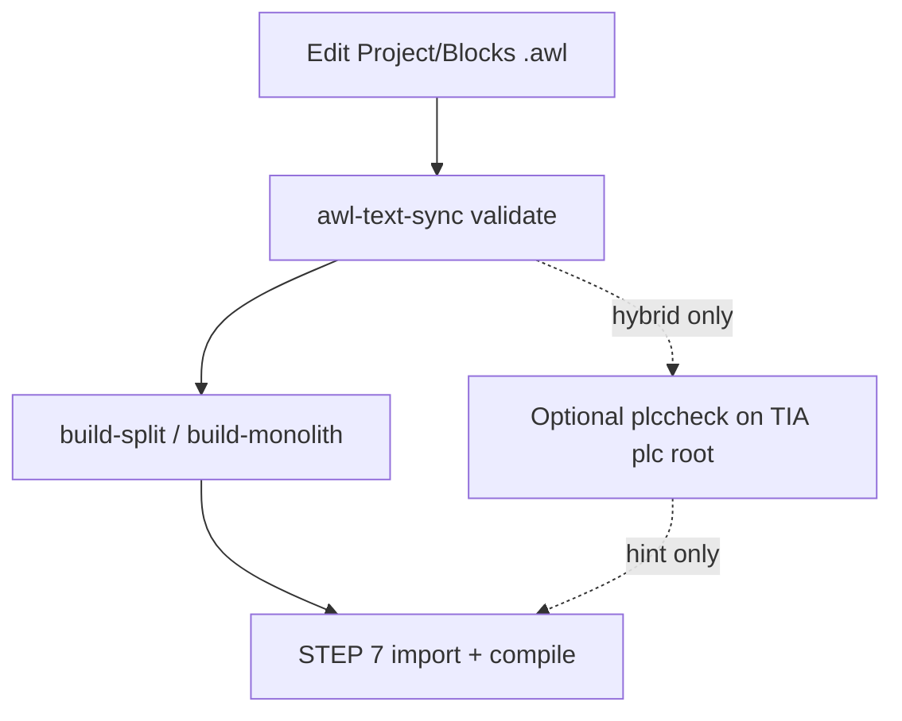

# Siemens Classic AWL/STL — LSP reality, validators, and agent workflows

## What this skill does

Orients coding agents (and humans) on **what actually validates** STEP 7 Classic **AWL/STL** outside SIMATIC: which “LSP” stacks apply, which do not, and **which CLI gates** to run in repair loops. This is **not** a language reference — use `awl-language-reference` or `/KB` for mnemonics and instruction semantics.

**Myth-buster (one paragraph):** **IEC 61131-3 IL / Structured Text** and **Siemens STEP 7 STL (Statement List, mnemonic IL)** are different ecosystems. Extensions marketed for **SCL/ST** and **TIA-oriented exports** may attach to files named `.awl`, but that does **not** imply a **drop-in semantic replacement** for the **STEP 7 Classic STL compiler**. **truST / `trust-lsp`** targets **IEC ST**, not Siemens Classic STL exports.

---

## Authority pyramid (never invert)

Order of truth for **Classic AWL** in a split workspace:

1. **SIMATIC Manager (STEP 7) compile + import consistency** — authoritative for download-bound correctness.
2. **`awl-text-sync validate`** (and project `docs/validate_stl_rules.md` / `docs/working_rules.md`) — primary **machine gate** for git-friendly **Project/Blocks** until SIMATIC compiles.
3. **Optional `plccheck check` / Dynamic Siemens stack** — useful **only** when a **TIA-style PLC root** (`.plc.json` + supported sources) exists; **auxiliary**, may be noisy or wrong on pure Classic-only bodies.
4. **LLM / heuristic reasoning** — last; never treated as proof.

Agents must **not** “sign off” on production logic using **IDE diagnostics alone**.

---

## Classic-only vs hybrid (routing)

| Situation | Primary automation | Optional |
|-----------|-------------------|----------|
| **Classic-only** — `Project/Blocks/*.awl`, `Exported/`, `awl-text-sync` layout | `awl-text-sync validate` → `build-split` / `build-monolith` → engineer import + SIMATIC compile | Awlsim / `stl_precheck` (per `awlsim-runner` / `awl-step7` skills) — **not** STEP 7 |
| **Hybrid** — you have a **paired** TIA export tree with **`.plc.json`** | Same Classic gate **plus** optional `plccheck` on that PLC root (see `docs/siemens_plccheck_experiment.md`) | VS Code Dynamic Siemens extension for **human** editing; **[Unverified]** whether headless LSP diagnostic replay exists for agents without IDE bridge |

If there is **no** `.plc.json` + supported file set, **do not** treat `plccheck` as mandatory or assume it will analyze empty folders.

---

## Agent playbook (repair loop)

Recommended flow for batch agents (subprocess/CLI, not `textDocument/publishDiagnostics`):



1. Edit UTF-8 blocks under **`Project/`** per `docs/working_rules.md`.
2. Run **`awl-text-sync --workspace <root> validate`** — parse **stderr** / exit code; fix until clean. (`--workspace` is a **global** option and must appear **before** the subcommand.)
3. Run **`build-split`** or **`build-monolith`** as needed; treat **`Build/*` as generated**.
4. **Human** imports to STEP 7 and compiles — **mandatory** plant boundary.
5. **If and only if** a TIA-style PLC folder exists: `npx plccheck check <PLC_ROOT>` or `awl-text-sync --workspace <root> validate --plccheck-root PATH` after native validate.

**Key insight:** agents want **deterministic exit codes and parseable logs**, not LSP push events. LSP in Cursor/VS Code mainly helps **humans** unless you add custom capture/MCP.

---

## When *not* to use (misconceptions)

- **Do not** cite **truST `trust-lsp`** as the **STL/AWL** validator for Siemens Classic `.awl` — it is **IEC ST** scope; see `references/misconceptions.md`.
- **Do not** claim a **standalone open-source LSP** is the **semantic equivalent** of the STEP 7 Classic STL compiler — not established; vendor **TIA-aligned** tooling may attach to `.awl` with **mixed** Classic parity.
- **Do not** promise **`textDocument/republishDiagnostics`** to a headless agent **without** evidence of a bridge — mark **[Unverified]** if the user has no such tooling.

Full trigger list: `references/trigger-queries.md`.

---

## Command cheat sheet (Windows / PowerShell)

From an **awl-text-sync workspace** root (adjust paths):

```powershell
# Editable install once per clone
python -m venv .venv
.\.venv\Scripts\Activate.ps1
python -m pip install -e .

# Create Project/ from Exported/ (once per export)
awl-text-sync --workspace . split

# Native gate (--workspace before subcommand)
awl-text-sync --workspace . validate

awl-text-sync --workspace . validate --call-graph
awl-text-sync --workspace . validate --call-graph --open-call-graph

# Optional: after native validate, TIA-style PLC root with .plc.json
awl-text-sync --workspace . validate --plccheck-root 'C:\path\to\tia_style_plc'

# Build import artifacts (cp1252)
awl-text-sync --workspace . build-split
awl-text-sync --workspace . build-monolith

# Repo D0 smoke (fixtures + optional plccheck)
.\scripts\run_siemens_demo_D0.ps1

# Standalone plccheck (requires Node)
# PLC_ROOT must contain .plc.json — see docs/siemens_plccheck_experiment.md
npx plccheck check 'C:\path\to\plc\folder'
```

**License:** **`plccheck`** is **CC-BY-NC-4.0** — flag for **commercial** pipelines; this repo does not redistribute it. Details: `docs/siemens_plccheck_experiment.md`.

---

## Safety and plant boundary

For **safety interlocks**, fault reset, download readiness, and production logic — apply **`awl-safety-critical`** via **`awl-step7`** analysis/authoring. **No** autonomous PLC downloads; escalate human/controls engineer review per `identity.md` skill router.

---

## Cross-links (same repo)

| Need | Skill / doc |
|------|----------------|
| Edit rules, validator design | `docs/working_rules.md`, `docs/validate_stl_rules.md` |
| plccheck experiment matrix | `docs/siemens_plccheck_experiment.md` |
| Analyze / author FB/FC/DB/STL | `.cursor/skills/awl-step7/` |
| Simulate / stl_precheck gate | `.cursor/skills/awlsim-runner/` |
| Mnemonics, DE↔EN | `.cursor/skills/awl-language-reference/` |
| Manual-backed deep STL | `/KB` → `.cursor/skills/project-knowledgebase/` |
| Session handoff | `.cursor/skills/project-session-handoff/` |

---

## Progressive disclosure

- `references/classic-stl.md` — Classic workspace + native validate focus
- `references/tia-plccheck.md` — TIA layout, `plccheck`, Dynamic Siemens
- `references/misconceptions.md` — IL vs ST vs STL, trust-lsp
- `references/trigger-queries.md` — should / should-not triggers for routing
- `evals/evals.json` — sample agent prompts for qualitative skill review

---

## Out of scope

- Vendoring **proprietary** STEP 7 compiler behavior in this skill
- Full **STL instruction matrix** here — use **project-knowledgebase** (`/KB`) or Siemens manuals
- **Guaranteeing** extension/LSP parity with SIMATIC for every Classic construct
