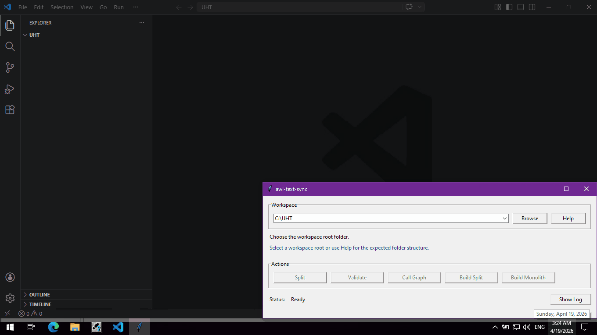
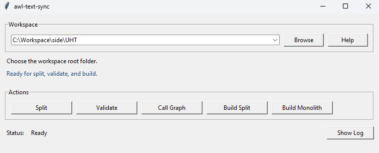

# awl-text-sync

STEP 7 AWL workspace tool for splitting, validating, and rebuilding exported projects in a git-friendly structure.

`awl-text-sync` is designed for local Windows maintenance workflows where engineers need to inspect existing STEP 7 code, make targeted edits, validate the result, and rebuild import-ready output without working inside one large exported `.AWL` file.

## Important

- This tool works on exported STEP 7 text sources. It does not replace STEP 7 itself.
- The safest workflow is still: export from STEP 7, edit in the workspace, validate, rebuild, import back, then compile in STEP 7.
- For the most reliable `split -> validate -> build` round trip, prefer `Absolute` export.
- `Symbolic` export is supported, but it depends more heavily on a complete and consistent `Symbols.sdf`.

## Why Use It

- Split one large exported AWL source into editable per-block files.
- Keep blocks and symbols in a predictable workspace layout.
- Safely translate comments into a language your team can read, without rewriting the surrounding STEP 7 structure by hand.
- Describe a fault or observed behavior to an LLM and get a fast surface-level analysis against readable per-block sources instead of one monolithic export.
- Validate changes before import back into STEP 7.
- Make review, search, and history easier when the project is stored in git.

## Installation

For normal Windows use, download the latest `awl-text-sync.exe` from GitHub Releases.

For local development from this repository:

```powershell
python -m pip install -e .
```

To run the UI directly from a cloned checkout:

```powershell
python -m awl_text_sync ui
```

## Quick Start

1. Export from STEP 7:
   - one `.AWL` source
   - one `.sdf` symbols file
   - place both files in `Exported/`
2. Split the exported project into editable files:

```powershell
awl-text-sync split --workspace .
```

3. Edit the generated files in `Project/Blocks/` and `Project/Symbols/`.
4. Validate the workspace before rebuilding:

```powershell
awl-text-sync validate --workspace .
```

5. Build STEP 7 import output when needed:

```powershell
awl-text-sync build-split --workspace .
awl-text-sync build-monolith --workspace .
```

6. Import the rebuilt output back into STEP 7 and compile there.

## Round Trip Workflow

The intended cycle is:

`STEP 7 export -> split -> edit -> validate -> build -> STEP 7 import -> STEP 7 compile`



For the detailed flow, see [docs/workflow.mermaid](./docs/workflow.mermaid).

## Desktop UI Preview

For local maintenance work on Windows, the desktop UI exposes the same workspace flow from one root folder.



Available actions in the UI:

- `Split`
- `Validate`
- `Call Graph`
- `Build Split`
- `Build Monolith`

The UI is intended for quick local operation near the equipment, without requiring routine CLI use.

## Commands

```powershell
awl-text-sync split --workspace .
awl-text-sync validate --workspace .
awl-text-sync validate --workspace . --call-graph
awl-text-sync validate --workspace . --call-graph --open-call-graph
awl-text-sync build-split --workspace .
awl-text-sync build-monolith --workspace .
awl-text-sync init-agent-docs --workspace .
awl-text-sync ui
```

GUI entry points:

```powershell
awl-text-sync-ui
s7p-sync-ui
```

## Workspace Layout

```text
workspace/
  Exported/
  Project/
    Blocks/
    Symbols/
  Build/
    Monolith/
    SplitImport/
    Reports/
```

- `Exported/` contains the original STEP 7 handoff files.
- `Project/Blocks/` contains editable AWL block files in `UTF-8`.
- `Project/Symbols/` contains the copied `.sdf` used during validate and build, also normalized to `UTF-8`.
- `Build/Monolith/` contains generated monolithic STEP 7 import output in `cp1252`.
- `Build/SplitImport/` contains generated split import output in `cp1252`.
- `Build/Reports/` contains optional reports such as call graph HTML output.

## Encoding Policy

- `split` auto-detects the source encoding of exported `.AWL` and `.sdf` files.
- Editable project files are normalized to `UTF-8`.
- `build-monolith` and `build-split` always write STEP 7 import output in `cp1252`.
- `validate` checks whether project files can round-trip safely back to STEP 7-compatible output.
- Treat `Build/*` as generated output. Do not edit or re-save those files unless you intentionally want to change the generated result.

## Agent Bootstrap Docs

Create agent-facing workspace instructions when a workspace should be edited by Codex, Cursor, Claude Code, or another AI assistant:

```powershell
awl-text-sync init-agent-docs --workspace .
```

This writes:

- `AGENTS.md`
- `docs/working_rules.md`
- `docs/awl_reference.md`

Existing files are skipped by default. Use `--force` only when you intentionally want to overwrite the generated agent docs.

## Editing Rules

- One block per `.awl` file.
- Keep the filename, block header, and symbol entry aligned.
- Keep pointer literals absolute.
- Do not mix symbolic and absolute DB access in one reference.
- Make the smallest safe change that solves the task.

Short working rules: [`docs/working_rules.md`](./docs/working_rules.md)  
Detailed STL validation rules: [`docs/validate_stl_rules.md`](./docs/validate_stl_rules.md)

## STEP 7 Import Notes

1. Import the rebuilt AWL source from `Build/Monolith/`, or use the files from `Build/SplitImport/`.
2. Import the matching symbols file from the same `Build/` output set.
3. Compile in STEP 7 only after both the block source and symbols are in sync.

If the symbols file and block text disagree, or if generated files were re-saved with the wrong encoding, STEP 7 may reject the import or fail to compile.
