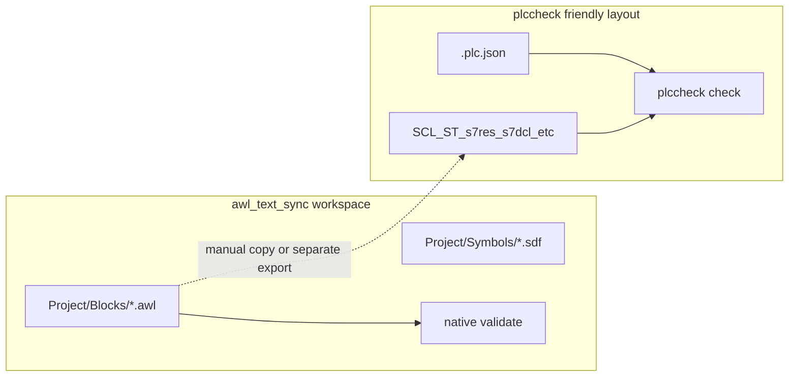

# Siemens Dynamic Language Support / `plccheck` experiment

This document supports the **`feature/siemens-plccheck-experiment`** work: optional use of **`plccheck`** (npm CLI backing **Dynamic Siemens Language Support**) alongside **native** `awl-text-sync` validation.

## Goals

- See whether **`plccheck check`** adds useful diagnostics for **`.awl`** (or sibling Siemens text) when a **TIA-style** project root is available.
- Keep **`awl-text-sync validate`** the **primary** gate for STEP 7 Classic split workspaces; **`plccheck`** is **auxiliary** only.

## License

The **`plccheck`** package on npm is **CC-BY-NC-4.0**. If your use is commercial, ensure you have the right to use it; this repo does **not** redistribute that binary.

## Layout mismatch (important)

`awl-text-sync` uses a **STEP 7 export–oriented** layout (`Project/Blocks/*.awl`, `Project/Symbols/*.sdf`). **`plccheck`** expects a **PLC root** with **`.plc.json`** and typically **TIA-oriented** sources (for example `.scl`, `.st`, `.s7res`, `.s7dcl`, tag XML trees)—not the same folder shape as a bare block split.



For a fair test you usually need **either** a **TIA export** tree with `.plc.json` **or** a **minimal synthetic** PLC folder; dropping only `Project/Blocks/*.awl` into an empty folder is **unlikely** to work without matching project metadata.

## Repo fixtures (synthetic, non-proprietary)

| Fixture | Path | Purpose |
|--------|------|--------|
| Classic split workspace | [`tests/fixtures/classic_demo_workspace/`](../tests/fixtures/classic_demo_workspace/) | `Exported/` + `Project/` from the same **numeric** monolith pattern as unit tests; `awl-text-sync validate` **passes** (5 blocks). |
| Minimal `plccheck` root | [`tests/fixtures/plccheck_demo_minimal/`](../tests/fixtures/plccheck_demo_minimal/) | `.plc.json` + `Main.scl` so `plccheck check` analyzes one file. **Not** semantically paired with Classic blocks—**smoke / plumbing only**. |

See [`tests/fixtures/README.md`](../tests/fixtures/README.md).

## Open VSX / Marketplace (same extension)

- **Human listing:** [Visual Studio Marketplace — Dynamic Siemens Language Support](https://marketplace.visualstudio.com/items?itemName=DynamicEngineering.dynamic-siemens-language-support)
- **Machine metadata / VSIX:** [Open VSX API — latest](https://open-vsx.org/api/DynamicEngineering/dynamic-siemens-language-support/latest)

## How to run the spike (PowerShell)

From the repo root:

```powershell
# PLC_ROOT must contain .plc.json
.\scripts\siemens_plccheck_spike.ps1 -PlcRoot 'C:\path\to\plc\folder'

# Optional: print Open VSX latest version string only
.\scripts\siemens_plccheck_spike.ps1 -FetchOpenVsxVersionOnly
```

Requires **Node.js** and network access for **`npx plccheck`** (unless `plccheck` is on `PATH`).

## Automated D0 smoke (script)

```powershell
.\scripts\run_siemens_demo_D0.ps1
```

Runs native validate on **`tests/fixtures/classic_demo_workspace`**, `plccheck check` on **`tests/fixtures/plccheck_demo_minimal`**, then **`validate --plccheck-root`**. If **`docs/demo_runs/`** exists, appends a line to **`docs/demo_runs/D0_smoke.log`**.

## Integrated CLI (optional post-check)

After native validation succeeds:

```powershell
awl-text-sync --workspace . validate --plccheck-root 'C:\path\to\tia_style_plc'
```

On Windows, the integration resolves **`npx.cmd`** when `plccheck` is not on `PATH`. If neither `plccheck` nor `npx` is available, the command fails with a clear message.

## Optional pytest (live `plccheck`)

```powershell
$env:RUN_PLCCHECK_INTEGRATION = '1'
python -m pytest tests/test_plccheck_integration_optional.py -v
```

Default **`python -m pytest`** skips these tests so CI stays Node-free.

## Hard gates (unchanged)

For real plant PLCs: **STEP 7 Classic compile / consistency** and **engineer review** remain authoritative. **No VS Code extension or `plccheck` result replaces that.**

## Scenario matrix (D0–D6)

Run in order on a **paired** Classic workspace + real **TIA-style** PLC root when testing semantics. Repo fixtures only cover **D0_smoke** plumbing.

| Scenario ID | Intent | Classic side | TIA / `plccheck` side | Pass / record |
|-------------|--------|--------------|----------------------|----------------|
| **D0_smoke** | Toolchains run | `awl-text-sync --workspace tests/fixtures/classic_demo_workspace validate` | `plccheck check tests/fixtures/plccheck_demo_minimal` | **Pass** in CI/dev (2026-04-29): validate 5 blocks; plccheck “files analyzed 1”; exit 0. |
| **D1_symbol_ref** | Symbol / tag resolution | Blocks + `Symbols.sdf` from real export | Matching TIA tags / XML | **Pending engineer** — synthetic fixtures not paired. |
| **D2_call_interface** | `CALL FB/FC`, instance DB | Real `CALL` patterns | Same logic in exported ST/SCL | **Pending engineer** |
| **D3_db_access** | `OPN DB`, absolute / symbolic DB ops | Patterns you rely on | DB/UDT in TIA export | **Pending engineer** |
| **D4_jump_network** | `JU`/`JC`, labels | Classic networks | Textual export if any | **Pending engineer** (often **N/A** or noisy for IL) |
| **D5_negative_syntax** | Deliberate illegal line in **scratch copy** | STEP 7 must reject | `plccheck` may/may not | **Pending engineer** |
| **D6_agnostic** | Noise baseline | Legal Classic | Count diagnostics with no STEP 7 counterpart | **Pending engineer** |

**STEP 7 Classic compile** column for all rows: **manual** in SIMATIC Manager (authoritative).

## Usefulness rubric (0–2 each)

| Criterion | Question |
|-----------|----------|
| **Signal** | Does `plccheck` surface issues you also see in STEP 7 or that native `validate` misses? |
| **Specificity** | Are false positives rare on real D2–D4 patterns? |
| **Fit** | Do you already maintain a `.plc.json` TIA tree beside Classic exports? |
| **Ops** | Acceptable Node/`npx`, telemetry, and **CC-BY-NC**? |
| **Safety** | Never treat `plccheck` clean as more than a **hint** next to compile + review. |

**Bar for “useful”:** meaningful **Signal** + **Specificity** on **your** real paired exports. **Classic-only** shops may see **D0** only.

## Demo verdict (template — update after D1–D6)

- **Status:** **Hybrid / incomplete** — D0 reproducible on repo fixtures; **D1–D6** require engineer-owned paired exports.
- **Evidence:**
  1. Synthetic **Classic** + synthetic **SCL stub** both pass tooling; they do **not** prove STL/SCL semantic equivalence.
  2. **`plccheck`** adds value mainly where **TIA-style** sources already exist beside Classic.
  3. **STEP 7 compile + review** remain the only acceptable sign-off for plant code.

| Criterion | Score (0–2) | Notes |
|-----------|-------------|-------|
| Signal | *TBD* | Fill after real paired run. |
| Specificity | *TBD* | |
| Fit | *TBD* | |
| Ops | *TBD* | |
| Safety | 2 | Policy: auxiliary only. |

## Evaluation log (historical / repo-style sample)

| Sample / project | Native `awl-text-sync validate` | `plccheck check` | STEP 7 Classic compile |
| ---------------- | --------------------------------- | ---------------- | ---------------------- |
| **Repo-style minimal blocks** — same shape as test monolith stubs (e.g. FB 68, FC 100, DB 1, OB 1 with empty `NETWORK` bodies; see `NUMERIC_MONOLITH` in `tests/test_parser_and_naming.py`) | **Pass** — covered by `python -m pytest` | **N/A** without TIA tree; use **`plccheck_demo_minimal`** for smoke only | **Manual** — import/built output and compile in SIMATIC Manager |
| **classic_demo_workspace** fixture | **Pass** (5 blocks) | **Smoke** on `plccheck_demo_minimal` only (unpaired SCL stub) | **Manual** (fixture not loaded in CPU) |
