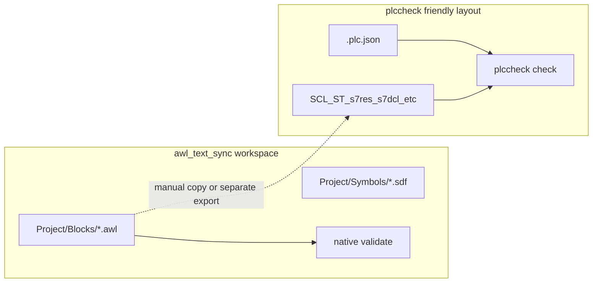

# Siemens Dynamic Language Support / `plccheck` experiment

This document supports the **`feature/siemens-plccheck-experiment`** work: optional use of **`plccheck`** (npm CLI backing **Dynamic Siemens Language Support**) alongside **native** `awl-text-sync` validation.

## Goals

- See whether **`plccheck check`** adds useful diagnostics for **`.awl`** (or sibling Siemens text) when a **TIA-style** project root is available.
- Keep **`awl-text-sync validate`** the **primary** gate for STEP 7 Classic split workspaces; **`plccheck`** is **auxiliary** only.

## License

The **`plccheck`** package on npm is **CC-BY-NC-4.0**. If your use is commercial, ensure you have the right to use it; this repo does **not** redistribute that binary.

## Layout mismatch (important)

`awl-text-sync` uses a **STEP 7 export–oriented** layout (`Project/Blocks/*.awl`, `Project/Symbols/*.sdf`). **`plccheck`** expects a **PLC root** with **`.plc.json`** and typically **TIA-oriented** sources (for example `.scl`, `.st`, `.s7res`, `.s7dcl`, tag XML trees)—not the same folder shape as a bare block split.



For a fair test you usually need **either** a **TIA export** tree with `.plc.json` **or** a **minimal synthetic** PLC folder; dropping only `Project/Blocks/*.awl` into an empty folder is **unlikely** to work without matching project metadata.

## Open VSX / Marketplace (same extension)

- **Human listing:** [Visual Studio Marketplace — Dynamic Siemens Language Support](https://marketplace.visualstudio.com/items?itemName=DynamicEngineering.dynamic-siemens-language-support)
- **Machine metadata / VSIX:** [Open VSX API — latest](https://open-vsx.org/api/DynamicEngineering/dynamic-siemens-language-support/latest)

## How to run the spike (PowerShell)

From the repo root:

```powershell
# PLC_ROOT must contain .plc.json
.\scripts\siemens_plccheck_spike.ps1 -PlcRoot 'C:\path\to\plc\folder'

# Optional: print Open VSX latest version string only
.\scripts\siemens_plccheck_spike.ps1 -FetchOpenVsxVersionOnly
```

Requires **Node.js** and network access for **`npx plccheck`** (unless `plccheck` is on `PATH`).

## Integrated CLI (optional post-check)

After native validation succeeds:

```powershell
awl-text-sync validate --workspace . --plccheck-root 'C:\path\to\tia_style_plc'
```

If `--plccheck-root` is set, the tool requires **`.plc.json`** under that path, then runs `plccheck check` (or `npx --yes plccheck check` if `plccheck` is not on `PATH`). Non-zero `plccheck` exit code fails the command.

## Hard gates (unchanged)

For real plant PLCs: **STEP 7 Classic compile / consistency** and **engineer review** remain authoritative. **No VS Code extension or `plccheck` result replaces that.**

## Evaluation log (fill as you experiment)

| Sample / project | Native `awl-text-sync validate` | `plccheck check` (extension-backed toolchain) | STEP 7 Classic compile |
| ---------------- | --------------------------------- | --------------------------------------------- | ---------------------- |
| **Repo-style minimal blocks** — same shape as test monolith stubs (e.g. FB 68, FC 100, DB 1, OB 1 with empty `NETWORK` bodies; see `NUMERIC_MONOLITH` in `tests/test_parser_and_naming.py`) | **Pass** — covered by `python -m pytest` | **N/A** — no `.plc.json` / TIA tree in repo; run only after you add a `plccheck`-friendly PLC root | **Manual** — import/built output and compile in SIMATIC Manager |
